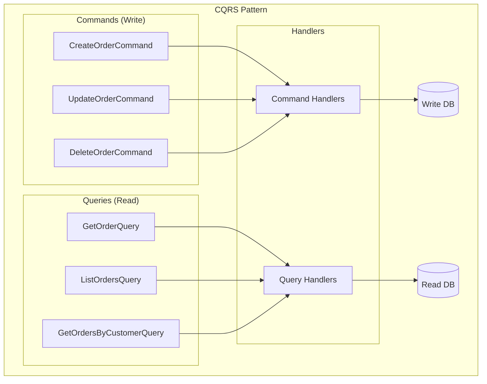
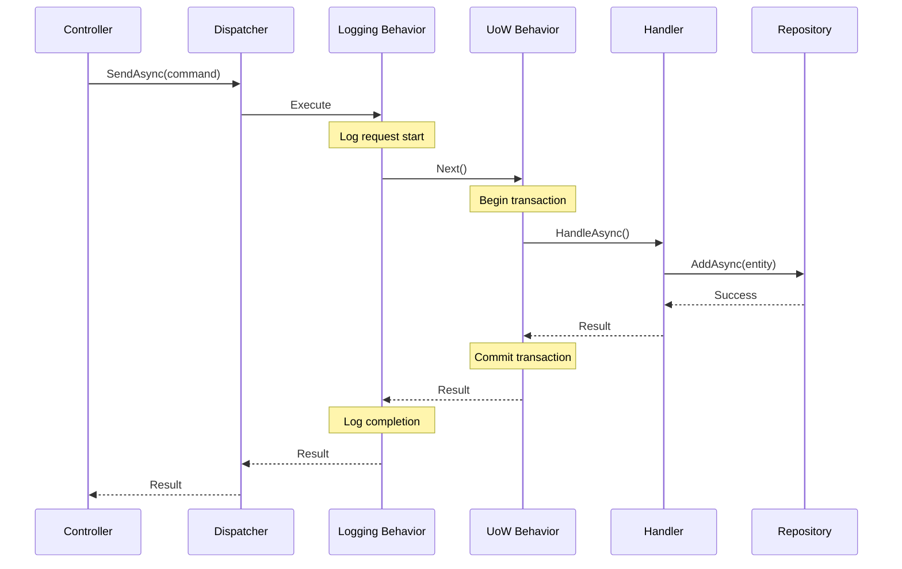

# CQRS and Messaging

LunaArch implements the CQRS (Command Query Responsibility Segregation) pattern with a lightweight, AOT-friendly dispatcher.

## Overview



## Commands

Commands represent intentions to change the system state. They should be named as imperative verbs.

### Command Interface

```csharp
// Provided by LunaArch.Abstractions
public interface ICommand<TResult>;

// Handler interface
public interface ICommandHandler<in TCommand, TResult>
    where TCommand : ICommand<TResult>
{
    Task<TResult> HandleAsync(TCommand command, CancellationToken cancellationToken = default);
}
```

### Command Examples

```csharp
// Command that returns a result
public sealed record CreateOrderCommand(
    Guid CustomerId,
    IReadOnlyList<OrderItemDto> Items) : ICommand<Guid>;

// Command that returns Unit (void equivalent)
public sealed record CancelOrderCommand(Guid OrderId) : ICommand<Unit>;

// Command with validation attributes
public sealed record UpdateOrderCommand(
    Guid OrderId,
    [Required] string ShippingAddress) : ICommand<Unit>;
```

### Command Handler

```csharp
public sealed class CreateOrderCommandHandler(
    IRepository<Order, Guid> orderRepository,
    IRepository<Customer, Guid> customerRepository,
    IRepository<Product, Guid> productRepository)
    : ICommandHandler<CreateOrderCommand, Guid>
{
    public async Task<Guid> HandleAsync(
        CreateOrderCommand command,
        CancellationToken cancellationToken)
    {
        // 1. Validate preconditions
        var customer = await customerRepository.GetByIdAsync(
            command.CustomerId, cancellationToken)
            ?? throw new NotFoundException(nameof(Customer), command.CustomerId);

        // 2. Create aggregate via factory method
        var order = Order.Create(customer.Id);

        // 3. Execute business operations
        foreach (var item in command.Items)
        {
            var product = await productRepository.GetByIdAsync(
                item.ProductId, cancellationToken)
                ?? throw new NotFoundException(nameof(Product), item.ProductId);

            order.AddLine(product.Id, item.Quantity, product.Price);
        }

        // 4. Persist
        await orderRepository.AddAsync(order, cancellationToken);

        // 5. Return result
        return order.Id;
    }
}
```

## Queries

Queries retrieve data without modifying state. They should return DTOs, never domain entities.

### Query Interface

```csharp
// Provided by LunaArch.Abstractions
public interface IQuery<TResult>;

// Handler interface
public interface IQueryHandler<in TQuery, TResult>
    where TQuery : IQuery<TResult>
{
    Task<TResult> HandleAsync(TQuery query, CancellationToken cancellationToken = default);
}
```

### Query Examples

```csharp
// Single item query
public sealed record GetOrderByIdQuery(Guid OrderId) : IQuery<OrderDetailsDto?>;

// Collection query with filtering
public sealed record GetOrdersQuery(
    Guid? CustomerId = null,
    OrderStatus? Status = null,
    int PageNumber = 1,
    int PageSize = 20) : IQuery<PagedResult<OrderSummaryDto>>;

// DTOs for query results
public sealed record OrderDetailsDto(
    Guid Id,
    Guid CustomerId,
    string CustomerName,
    IReadOnlyList<OrderLineDto> Lines,
    decimal Total,
    string Status,
    DateTimeOffset CreatedAt);

public sealed record OrderSummaryDto(
    Guid Id,
    string CustomerName,
    decimal Total,
    string Status);
```

### Query Handler

```csharp
public sealed class GetOrderByIdQueryHandler(
    IReadRepository<Order, Guid> orderRepository)
    : IQueryHandler<GetOrderByIdQuery, OrderDetailsDto?>
{
    public async Task<OrderDetailsDto?> HandleAsync(
        GetOrderByIdQuery query,
        CancellationToken cancellationToken)
    {
        var spec = new OrderWithLinesSpecification(query.OrderId);
        var order = await orderRepository.GetFirstOrDefaultAsync(spec, cancellationToken);

        if (order is null)
            return null;

        return new OrderDetailsDto(
            order.Id,
            order.CustomerId,
            order.Customer.Name,
            order.Lines.Select(l => new OrderLineDto(
                l.ProductId,
                l.Quantity,
                l.UnitPrice.Amount)).ToList(),
            order.Total.Amount,
            order.Status.Name,
            order.CreatedAt);
    }
}
```

## Dispatcher

The dispatcher routes commands and queries to their respective handlers.

### Dispatcher Architecture



### Dispatcher Registration (AOT-Friendly)

```csharp
// In Program.cs or DI setup
services.AddDispatcher(builder =>
{
    // Explicit handler registration (no reflection)
    builder.RegisterCommandHandler<CreateOrderCommand, Guid, CreateOrderCommandHandler>();
    builder.RegisterCommandHandler<CancelOrderCommand, Unit, CancelOrderCommandHandler>();
    
    builder.RegisterQueryHandler<GetOrderByIdQuery, OrderDetailsDto?, GetOrderByIdQueryHandler>();
    builder.RegisterQueryHandler<GetOrdersQuery, PagedResult<OrderSummaryDto>, GetOrdersQueryHandler>();

    // Register pipeline behaviors
    builder.AddBehavior(typeof(LoggingBehavior<,>));
    builder.AddBehavior(typeof(UnitOfWorkBehavior<,>));
});
```

### Using the Dispatcher

```csharp
[ApiController]
[Route("api/orders")]
public class OrdersController(IDispatcher dispatcher) : ControllerBase
{
    [HttpPost]
    public async Task<ActionResult<ApiResponse<Guid>>> Create(
        CreateOrderRequest request,
        CancellationToken cancellationToken)
    {
        var command = new CreateOrderCommand(
            request.CustomerId,
            request.Items);

        var orderId = await dispatcher.SendAsync(command, cancellationToken);

        return CreatedAtAction(
            nameof(GetById),
            new { id = orderId },
            ApiResponse<Guid>.Success(orderId));
    }

    [HttpGet("{id:guid}")]
    public async Task<ActionResult<ApiResponse<OrderDetailsDto>>> GetById(
        Guid id,
        CancellationToken cancellationToken)
    {
        var query = new GetOrderByIdQuery(id);
        var result = await dispatcher.SendAsync(query, cancellationToken);

        return result is null
            ? NotFound()
            : Ok(ApiResponse<OrderDetailsDto>.Success(result));
    }
}
```

## Pipeline Behaviors

Pipeline behaviors provide cross-cutting concerns that execute around every command/query.

### Behavior Interface

```csharp
public interface IPipelineBehavior<TRequest, TResponse>
{
    Task<TResponse> HandleAsync(
        TRequest request,
        Func<Task<TResponse>> next,
        CancellationToken cancellationToken = default);
}
```

### Built-in Behaviors

#### Logging Behavior
```csharp
public sealed class LoggingBehavior<TRequest, TResponse>(
    ILogger<LoggingBehavior<TRequest, TResponse>> logger)
    : IPipelineBehavior<TRequest, TResponse>
    where TRequest : notnull
{
    public async Task<TResponse> HandleAsync(
        TRequest request,
        Func<Task<TResponse>> next,
        CancellationToken cancellationToken = default)
    {
        var requestName = typeof(TRequest).Name;
        logger.LogInformation("Handling {RequestName}", requestName);

        var stopwatch = Stopwatch.StartNew();
        try
        {
            var response = await next();
            stopwatch.Stop();

            logger.LogInformation(
                "Handled {RequestName} in {ElapsedMs}ms",
                requestName,
                stopwatch.ElapsedMilliseconds);

            return response;
        }
        catch (Exception ex)
        {
            stopwatch.Stop();
            logger.LogError(
                ex,
                "Error handling {RequestName} after {ElapsedMs}ms",
                requestName,
                stopwatch.ElapsedMilliseconds);
            throw;
        }
    }
}
```

#### Unit of Work Behavior
```csharp
public sealed class UnitOfWorkBehavior<TRequest, TResponse>(
    IUnitOfWork unitOfWork)
    : IPipelineBehavior<TRequest, TResponse>
    where TRequest : ICommand<TResponse>
{
    public async Task<TResponse> HandleAsync(
        TRequest request,
        Func<Task<TResponse>> next,
        CancellationToken cancellationToken = default)
    {
        var response = await next();
        await unitOfWork.SaveChangesAsync(cancellationToken);
        return response;
    }
}
```

### Custom Behavior Example

```csharp
// Validation behavior
public sealed class ValidationBehavior<TRequest, TResponse>(
    IEnumerable<IValidator<TRequest>> validators)
    : IPipelineBehavior<TRequest, TResponse>
    where TRequest : notnull
{
    public async Task<TResponse> HandleAsync(
        TRequest request,
        Func<Task<TResponse>> next,
        CancellationToken cancellationToken = default)
    {
        if (!validators.Any())
        {
            return await next();
        }

        var context = new ValidationContext<TRequest>(request);
        var failures = validators
            .Select(v => v.Validate(context))
            .SelectMany(r => r.Errors)
            .Where(f => f is not null)
            .ToList();

        if (failures.Count != 0)
        {
            throw new ValidationException(failures);
        }

        return await next();
    }
}
```

## Unit Return Type

For commands that don't return a meaningful result, use the `Unit` type:

```csharp
// Provided by LunaArch.Abstractions
public readonly struct Unit : IEquatable<Unit>
{
    public static readonly Unit Value = new();
    
    public bool Equals(Unit other) => true;
    public override bool Equals(object? obj) => obj is Unit;
    public override int GetHashCode() => 0;
}
```

### Usage

```csharp
// Command without meaningful return
public sealed record DeleteOrderCommand(Guid OrderId) : ICommand<Unit>;

// Handler
public sealed class DeleteOrderCommandHandler(
    IRepository<Order, Guid> repository)
    : ICommandHandler<DeleteOrderCommand, Unit>
{
    public async Task<Unit> HandleAsync(
        DeleteOrderCommand command,
        CancellationToken cancellationToken)
    {
        var order = await repository.GetByIdAsync(command.OrderId, cancellationToken)
            ?? throw new NotFoundException(nameof(Order), command.OrderId);

        repository.Remove(order);

        return Unit.Value;
    }
}
```

## Best Practices

### 1. One Handler Per Command/Query
```csharp
// ✅ Single responsibility
public class CreateOrderCommandHandler : ICommandHandler<CreateOrderCommand, Guid> { }
public class UpdateOrderCommandHandler : ICommandHandler<UpdateOrderCommand, Unit> { }

// ❌ Don't combine multiple commands
public class OrderCommandHandler : 
    ICommandHandler<CreateOrderCommand, Guid>,
    ICommandHandler<UpdateOrderCommand, Unit> { }
```

### 2. Keep Commands/Queries Immutable
```csharp
// ✅ Immutable record
public sealed record CreateOrderCommand(
    Guid CustomerId,
    IReadOnlyList<OrderItemDto> Items) : ICommand<Guid>;

// ❌ Mutable class
public class CreateOrderCommand : ICommand<Guid>
{
    public Guid CustomerId { get; set; } // Mutable!
}
```

### 3. Return DTOs from Queries, Never Entities
```csharp
// ✅ Returns DTO
public sealed record GetOrderQuery(Guid Id) : IQuery<OrderDto?>;

// ❌ Returns domain entity
public sealed record GetOrderQuery(Guid Id) : IQuery<Order?>; // Wrong!
```

### 4. Use Specifications for Complex Queries
```csharp
// ✅ Encapsulated query logic
var spec = new OrdersByCustomerSpecification(customerId)
    .WithStatus(OrderStatus.Completed)
    .OrderByDescending(o => o.CreatedAt)
    .WithPaging(pageNumber, pageSize);

var orders = await repository.GetBySpecificationAsync(spec);
```

## Next Steps

- [Persistence](persistence.md) - Repository and specifications
- [Testing](testing.md) - Testing commands and queries
