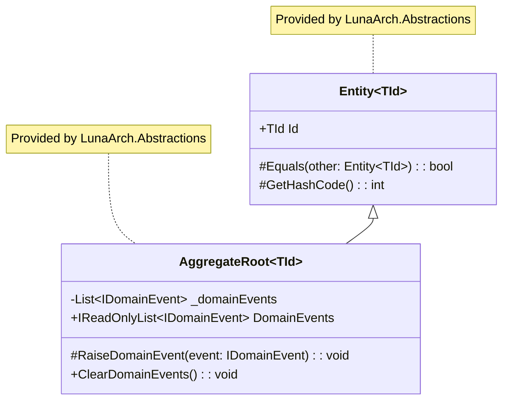

# Domain Primitives

Domain primitives are the building blocks of your domain model. LunaArch provides base classes for `Entity` and `AggregateRoot`, while recommending established source generator packages for Value Objects, Strongly Typed IDs, and Smart Enums.

## Recommended Packages

| Concept | Package | Documentation |
|---------|---------|---------------|
| Value Objects | [Vogen](https://github.com/SteveDunn/Vogen) | [docs.vogen.com](https://docs.vogen.com/) |
| Strongly Typed IDs | [Vogen](https://github.com/SteveDunn/Vogen) | [docs.vogen.com](https://docs.vogen.com/) |
| Smart Enums | [NetEscapades.EnumGenerators](https://github.com/andrewlock/NetEscapades.EnumGenerators) | [GitHub README](https://github.com/andrewlock/NetEscapades.EnumGenerators) |
| Guard Clauses | [Ardalis.GuardClauses](https://github.com/ardalis/GuardClauses) | [GitHub README](https://github.com/ardalis/GuardClauses) |

## Class Hierarchy



## Entity

An entity is an object with a unique identity that persists over time. LunaArch provides the base class.

```csharp
// Base class provided by LunaArch.Abstractions
public abstract class Entity<TId> : IEquatable<Entity<TId>>
    where TId : notnull
{
    public TId Id { get; protected init; } = default!;
}
```

### Usage Example

```csharp
public class OrderLine : Entity<OrderLineId>
{
    public ProductId ProductId { get; private set; }
    public int Quantity { get; private set; }
    public Money UnitPrice { get; private set; }

    private OrderLine() { } // EF Core constructor

    internal OrderLine(ProductId productId, int quantity, Money unitPrice)
    {
        Id = OrderLineId.New();
        ProductId = productId;
        Quantity = Guard.Against.NegativeOrZero(quantity);
        UnitPrice = unitPrice;
    }
}
```

## Aggregate Root

An aggregate root is an entity that acts as the entry point to a cluster of related objects.

```csharp
// Base class provided by LunaArch.Abstractions
public abstract class AggregateRoot<TId> : Entity<TId>
    where TId : notnull
{
    private readonly List<IDomainEvent> _domainEvents = [];
    
    public IReadOnlyList<IDomainEvent> DomainEvents => _domainEvents.AsReadOnly();

    protected void RaiseDomainEvent(IDomainEvent domainEvent)
        => _domainEvents.Add(domainEvent);

    public void ClearDomainEvents()
        => _domainEvents.Clear();
}
```

## Value Objects with Vogen

[Vogen](https://github.com/SteveDunn/Vogen) is a source generator that creates Value Objects with proper equality, validation, and serialization support.

### Installation

```xml
<PackageReference Include="Vogen" PrivateAssets="all" />
```

### Basic Usage

```csharp
using Vogen;

[ValueObject<decimal>]
public partial struct Money
{
    private static Validation Validate(decimal value) =>
        value >= 0 
            ? Validation.Ok 
            : Validation.Invalid("Money cannot be negative");
}

// Usage:
var price = Money.From(99.99m);
```

### Value Object with Multiple Properties

For value objects with multiple properties, use a record:

```csharp
using Vogen;

[ValueObject(typeof(MoneyData))]
public partial struct Money
{
    public decimal Amount => Value.Amount;
    public string Currency => Value.Currency;

    private static Validation Validate(MoneyData value)
    {
        if (value.Amount < 0)
            return Validation.Invalid("Amount cannot be negative");
        if (string.IsNullOrWhiteSpace(value.Currency) || value.Currency.Length != 3)
            return Validation.Invalid("Currency must be 3 characters");
        return Validation.Ok;
    }
}

public readonly record struct MoneyData(decimal Amount, string Currency);
```

### Alternative: Simple Record for Complex Value Objects

```csharp
public sealed record Address
{
    public string Street { get; }
    public string City { get; }
    public string PostalCode { get; }

    private Address(string street, string city, string postalCode)
    {
        Street = street;
        City = city;
        PostalCode = postalCode;
    }

    public static Address Create(string street, string city, string postalCode)
    {
        Guard.Against.NullOrWhiteSpace(street);
        Guard.Against.NullOrWhiteSpace(city);
        Guard.Against.NullOrWhiteSpace(postalCode);
        
        return new Address(street, city, postalCode);
    }
}
```

## Strongly Typed IDs with Vogen

Vogen excels at creating strongly-typed identifiers that prevent primitive obsession.

```csharp
using Vogen;

// GUID-based ID
[ValueObject<Guid>]
public partial struct OrderId
{
    public static OrderId New() => From(Guid.NewGuid());
}

// Long-based ID (for database sequences)
[ValueObject<long>]
public partial struct ProductId
{
    private static Validation Validate(long value) =>
        value > 0 ? Validation.Ok : Validation.Invalid("ID must be positive");
}

// String-based ID
[ValueObject<string>]
public partial struct Sku
{
    private static Validation Validate(string value) =>
        !string.IsNullOrWhiteSpace(value) && value.Length <= 50
            ? Validation.Ok
            : Validation.Invalid("SKU must be non-empty and max 50 characters");
}
```

### Type Safety

```csharp
// Create IDs
var orderId = OrderId.New();
var productId = ProductId.From(12345L);

// Type safety - these won't compile:
// ProcessOrder(productId); // Error: Cannot convert ProductId to OrderId

// Access underlying value when needed
Guid rawId = orderId.Value;
```

### EF Core Configuration

```csharp
protected override void OnModelCreating(ModelBuilder modelBuilder)
{
    modelBuilder.Entity<Order>()
        .Property(o => o.Id)
        .HasConversion(
            id => id.Value,
            value => OrderId.From(value));
}
```

## Smart Enums with NetEscapades.EnumGenerators

[NetEscapades.EnumGenerators](https://github.com/andrewlock/NetEscapades.EnumGenerators) provides fast, source-generated extensions for enums.

### Installation

```xml
<PackageReference Include="NetEscapades.EnumGenerators" PrivateAssets="all" />
```

### Usage

```csharp
using NetEscapades.EnumGenerators;

[EnumExtensions]
public enum OrderStatus
{
    [Display(Name = "Draft Order")]
    Draft = 1,
    Submitted = 2,
    Processing = 3,
    Completed = 4,
    Cancelled = 5
}
```

### Generated Extensions

```csharp
// Fast string conversion (no boxing)
string name = OrderStatus.Draft.ToStringFast();

// Try parse without exceptions
if (OrderStatusExtensions.TryParse("Draft", out var status))
{
    // Use status
}

// Get all values
IReadOnlyList<OrderStatus> allStatuses = OrderStatusExtensions.GetValues();
```

### Enum with Behavior

```csharp
public static class OrderStatusBehavior
{
    public static bool CanTransitionTo(this OrderStatus current, OrderStatus next) =>
        (current, next) switch
        {
            (OrderStatus.Draft, OrderStatus.Submitted) => true,
            (OrderStatus.Submitted, OrderStatus.Processing) => true,
            (OrderStatus.Processing, OrderStatus.Completed) => true,
            (OrderStatus.Processing, OrderStatus.Cancelled) => true,
            _ => false
        };

    public static bool IsTerminal(this OrderStatus status) =>
        status is OrderStatus.Completed or OrderStatus.Cancelled;
}
```

## Guard Clauses with Ardalis.GuardClauses

[Ardalis.GuardClauses](https://github.com/ardalis/GuardClauses) provides a fluent, extensible guard clause library.

### Installation

```xml
<PackageReference Include="Ardalis.GuardClauses" />
```

### Basic Usage

```csharp
using Ardalis.GuardClauses;

public class Order
{
    public void AddLine(ProductId productId, int quantity, Money unitPrice)
    {
        Guard.Against.Default(productId.Value);
        Guard.Against.NegativeOrZero(quantity);
        Guard.Against.Null(unitPrice);
        
        // ... rest of method
    }
}
```

### Available Guards

```csharp
// Null checks
Guard.Against.Null(value);
Guard.Against.NullOrEmpty(stringValue);
Guard.Against.NullOrWhiteSpace(stringValue);
Guard.Against.NullOrEmpty(collection);

// Numeric checks
Guard.Against.Negative(number);
Guard.Against.NegativeOrZero(number);
Guard.Against.Zero(number);
Guard.Against.OutOfRange(number, min, max);

// String checks
Guard.Against.InvalidFormat(email, "email", @"^[\w-\.]+@([\w-]+\.)+[\w-]{2,4}$");
Guard.Against.LengthOutOfRange(text, minLength, maxLength);

// Default value check
Guard.Against.Default(guidValue);

// Enum validation
Guard.Against.EnumOutOfRange(enumValue);
```

### Custom Guard Extensions

```csharp
public static class CustomGuards
{
    public static OrderStatus InvalidStatus(
        this IGuardClause guardClause,
        OrderStatus status,
        params OrderStatus[] invalidStatuses)
    {
        if (invalidStatuses.Contains(status))
        {
            throw new InvalidOperationException(
                $"Operation not valid for status '{status}'");
        }
        return status;
    }
}

// Usage:
Guard.Against.InvalidStatus(order.Status, OrderStatus.Completed, OrderStatus.Cancelled);
```

## Auditable Entity

Interface for entities that track creation and modification.

```csharp
// Interface provided by LunaArch
public interface IAuditableEntity
{
    DateTimeOffset CreatedAt { get; set; }
    string? CreatedBy { get; set; }
    DateTimeOffset? ModifiedAt { get; set; }
    string? ModifiedBy { get; set; }
}
```

The `AuditableEntityInterceptor` automatically populates these fields.

## Soft Deletable Entity

Interface for entities that support soft delete.

```csharp
// Interface provided by LunaArch
public interface ISoftDeletable
{
    bool IsDeleted { get; set; }
    DateTimeOffset? DeletedAt { get; set; }
    string? DeletedBy { get; set; }
}
```

The `SoftDeleteInterceptor` automatically handles soft delete logic.

## Testing with Shouldly

```csharp
using Shouldly;

public class OrderTests
{
    [Fact]
    public void Create_ShouldInitializeOrderWithDraftStatus()
    {
        var customerId = CustomerId.New();

        var order = Order.Create(customerId);

        order.Status.ShouldBe(OrderStatus.Draft);
        order.CustomerId.ShouldBe(customerId);
        order.Lines.ShouldBeEmpty();
        order.DomainEvents.ShouldHaveSingleItem()
            .ShouldBeOfType<OrderCreatedEvent>();
    }

    [Fact]
    public void Money_ShouldRejectNegativeValues()
    {
        Should.Throw<ValueObjectValidationException>(() => Money.From(-1));
    }
}
```

## Best Practices

### 1. Keep Aggregates Small
```csharp
// ✅ Correct - Order only references Product by ID
public class Order : AggregateRoot<OrderId>
{
    public List<OrderLine> Lines { get; }
}

public class OrderLine : Entity<Guid>
{
    public ProductId ProductId { get; } // Reference by ID
}
```

### 2. Protect Invariants
```csharp
// ✅ Encapsulates behavior
public class Order
{
    private readonly List<OrderLine> _lines = [];
    public IReadOnlyList<OrderLine> Lines => _lines.AsReadOnly();

    public void AddLine(/* params */)
    {
        // Validation and business logic here
        _lines.Add(new OrderLine(/* params */));
    }
}
```

### 3. Use Factory Methods
```csharp
// ✅ Factory method ensures valid state
public class Order
{
    private Order() { }

    public static Order Create(CustomerId customerId)
    {
        Guard.Against.Default(customerId.Value);
        return new Order { CustomerId = customerId, Status = OrderStatus.Draft };
    }
}
```

## Next Steps

- [CQRS and Messaging](cqrs.md) - Commands and queries
- [Persistence](persistence.md) - Repository pattern
- [Testing](testing.md) - Testing domain models
