# Layer Responsibilities

Each layer in LunaArch has specific responsibilities and rules about what it can and cannot do.

## Layer Diagram

```mermaid
graph TB
    subgraph Presentation["🌐 Presentation Layer"]
        direction TB
        P1[Minimal APIs / FastEndpoints]
        P2[Middleware]
        P3[API Models/DTOs]
    end

    subgraph Application["⚙️ Application Layer"]
        direction TB
        A1[Commands & Queries]
        A2[Handlers]
        A3[DTOs/ViewModels]
        A4[Behaviors]
    end

    subgraph Domain["💎 Domain Layer"]
        direction TB
        D1[Aggregates/Entities]
        D2[Value Objects]
        D3[Domain Events]
        D4[Specifications]
        D5[Business Rules]
    end

    subgraph Infrastructure["🔧 Infrastructure Layer"]
        direction TB
        I1[Repositories]
        I2[DbContext]
        I3[External Services]
        I4[Dispatcher]
    end

    Presentation --> Application
    Application --> Domain
    Infrastructure --> Application
    Infrastructure --> Domain

    style Presentation fill:#e3f2fd
    style Application fill:#fff8e1
    style Domain fill:#fce4ec
    style Infrastructure fill:#e8f5e9
```



## Abstractions Layer

**Purpose**: Define contracts and base types without any implementation details.

**Contains**:
- `Entity<TId>` - Base class for entities with identity
- `AggregateRoot<TId>` - Base class for aggregate roots
- `ValueObject` - Base class for value objects
- `IDomainEvent` - Interface for domain events
- `ICommand<T>`, `IQuery<T>` - CQRS interfaces
- `IRepository<T, TId>` - Repository contract
- `IUnitOfWork` - Unit of work contract

**Rules**:
- ✅ No external dependencies (pure .NET)
- ✅ Only interfaces and abstract base classes
- ❌ No implementations
- ❌ No business logic

```csharp
// Example: Pure abstraction
public abstract class Entity<TId> where TId : notnull
{
    public TId Id { get; protected init; } = default!;
    
    // No implementation of persistence, validation, etc.
}
```

## Domain Layer

**Purpose**: Encapsulate all business logic and domain rules.

**Contains**:
- Domain entities and aggregates
- Value objects
- Domain events
- Specifications
- Business rules
- Guard clauses

**Rules**:
- ✅ Contains all business logic
- ✅ Rich domain models (behavior + data)
- ✅ Domain events for state changes
- ❌ No infrastructure concerns (DB, HTTP, etc.)
- ❌ No dependency on Application layer
- ❌ Entities should never be exposed directly to outside world

```csharp
// Example: Rich domain model
public sealed class Order : AggregateRoot<Guid>
{
    private readonly List<OrderLine> _lines = [];
    
    public IReadOnlyList<OrderLine> Lines => _lines.AsReadOnly();
    public OrderStatus Status { get; private set; }
    public Money Total { get; private set; }

    public void AddLine(Product product, int quantity)
    {
        // Business rule: Cannot modify completed orders
        Guard.Against.InvalidOperation(
            Status == OrderStatus.Completed,
            "Cannot modify completed order");
        
        var line = new OrderLine(product, quantity);
        _lines.Add(line);
        
        RecalculateTotal();
        RaiseDomainEvent(new OrderLineAddedEvent(Id, line.Id));
    }

    public void Complete()
    {
        // Business rule validation
        this.CheckRule(new OrderMustHaveLinesRule(_lines));
        
        Status = OrderStatus.Completed;
        RaiseDomainEvent(new OrderCompletedEvent(Id));
    }
}
```

## Application Layer

**Purpose**: Orchestrate application use cases without business logic.

**Contains**:
- Commands and command handlers
- Queries and query handlers
- Application services
- DTOs for data transfer
- Pipeline behaviors
- Application exceptions

**Rules**:
- ✅ Coordinates domain operations
- ✅ Handles transactions
- ✅ Maps between DTOs and domain
- ❌ No business logic (delegate to domain)
- ❌ No infrastructure details
- ❌ Never expose domain entities directly

```csharp
// Example: Application handler
public sealed class CreateOrderCommandHandler(
    IRepository<Order, Guid> orderRepository,
    IRepository<Customer, Guid> customerRepository)
    : ICommandHandler<CreateOrderCommand, Guid>
{
    public async Task<Guid> HandleAsync(
        CreateOrderCommand command,
        CancellationToken cancellationToken)
    {
        // 1. Load required entities
        var customer = await customerRepository.GetByIdAsync(
            command.CustomerId, 
            cancellationToken)
            ?? throw new NotFoundException(nameof(Customer), command.CustomerId);

        // 2. Delegate business logic to domain
        var order = Order.Create(customer);

        foreach (var item in command.Items)
        {
            order.AddLine(item.ProductId, item.Quantity);
        }

        // 3. Persist changes
        await orderRepository.AddAsync(order, cancellationToken);

        // 4. Return result (ID, not entity)
        return order.Id;
    }
}
```

## Infrastructure Layer

**Purpose**: Implement technical concerns and external integrations.

**Contains**:
- Repository implementations
- DbContext configurations
- External service clients
- Dispatcher implementation
- Interceptors (auditing, soft delete)
- Message queue adapters

**Rules**:
- ✅ Implements abstractions from inner layers
- ✅ Contains all persistence logic
- ✅ Handles external communications
- ❌ No business logic
- ❌ Should be replaceable without affecting domain

```csharp
// Example: Repository implementation
public class RepositoryBase<TEntity, TId>(DbContext context)
    : IRepository<TEntity, TId>
    where TEntity : AggregateRoot<TId>
    where TId : notnull
{
    protected DbSet<TEntity> DbSet => context.Set<TEntity>();

    public async Task<TEntity?> GetByIdAsync(
        TId id, 
        CancellationToken cancellationToken = default)
    {
        return await DbSet.FindAsync([id], cancellationToken);
    }

    public async Task AddAsync(
        TEntity entity, 
        CancellationToken cancellationToken = default)
    {
        await DbSet.AddAsync(entity, cancellationToken);
    }
}
```

## Presentation Layer

**Purpose**: Handle HTTP requests and present data to clients.

**Contains**:
- Minimal API endpoint groups **or** FastEndpoints
- Middleware
- Request/Response DTOs
- API configuration
- Authentication/Authorization setup

**Rules**:
- ✅ Transform HTTP requests to commands/queries
- ✅ Handle HTTP-specific concerns
- ✅ API versioning and documentation
- ❌ No business logic
- ❌ No direct database access
- ❌ Never return domain entities

LunaArch provides two API integration packages - choose one based on your preference:

### Option 1: Minimal APIs (Recommended for simplicity)

```csharp
// OrderEndpoints.cs
public class OrderEndpoints : IEndpointGroup
{
    public void MapEndpoints(IEndpointRouteBuilder app)
    {
        var group = app.MapGroup("/api/orders").WithTags("Orders");
        
        group.MapPost("/", CreateOrder);
        group.MapGet("/{id:guid}", GetOrder);
    }

    private static async Task<IResult> CreateOrder(
        CreateOrderRequest request,
        IDispatcher dispatcher,
        CancellationToken ct)
    {
        var command = new CreateOrderCommand(request.CustomerId, request.Items);
        var result = await dispatcher.SendAsync<CreateOrderCommand, Guid>(command, ct);
        return result.ToCreatedResponse($"/api/orders/{result.Value}");
    }

    private static async Task<IResult> GetOrder(
        Guid id,
        IDispatcher dispatcher,
        CancellationToken ct)
    {
        var order = await dispatcher.QueryAsync<GetOrderQuery, OrderDto?>(new(id), ct);
        return order.ToResponse();
    }
}

// Program.cs
builder.Services.AddEndpointGroups<OrderEndpoints>();
app.MapEndpointGroups();
```

### Option 2: FastEndpoints (Recommended for structure)

```csharp
// CreateOrderEndpoint.cs
public class CreateOrderEndpoint : CommandEndpoint<CreateOrderRequest, ApiResponse<Guid>>
{
    public override void Configure()
    {
        Post("/api/orders");
        AllowAnonymous();
    }

    public override async Task HandleAsync(CreateOrderRequest req, CancellationToken ct)
    {
        var command = new CreateOrderCommand(req.CustomerId, req.Items);
        var orderId = await SendCommandAsync<CreateOrderCommand, Guid>(command, ct);
        await SendCreatedAtAsync<GetOrderEndpoint>(new { id = orderId }, ApiResponse<Guid>.Ok(orderId), cancellation: ct);
    }
}

// GetOrderEndpoint.cs
public class GetOrderEndpoint : QueryEndpoint<GetOrderRequest, ApiResponse<OrderDto>>
{
    public override void Configure()
    {
        Get("/api/orders/{id}");
        AllowAnonymous();
    }

    public override async Task HandleAsync(GetOrderRequest req, CancellationToken ct)
    {
        var order = await SendQueryAsync<GetOrderQuery, OrderDto?>(new(req.Id), ct);
        
        if (order is null)
        {
            await SendNotFoundAsync(ct);
            return;
        }
        
        await SendOkAsync(ApiResponse<OrderDto>.Ok(order), ct);
    }
}

// Program.cs
builder.Services.AddLunaArchFastEndpoints();
app.UseFastEndpoints();
```

## Data Flow Diagram


## Cross-Cutting Concerns

Cross-cutting concerns are handled through pipeline behaviors:


## Next Steps

- [Domain Primitives](domain-primitives.md) - Deep dive into domain building blocks
- [CQRS and Messaging](cqrs.md) - Command/Query pattern details
- [Persistence](persistence.md) - Repository and Unit of Work patterns
