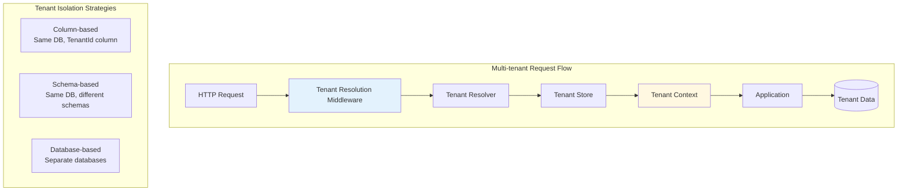
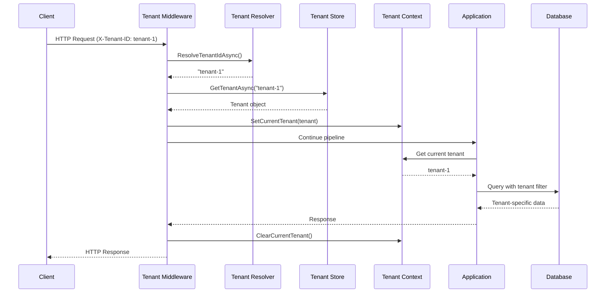

# Multi-tenancy

LunaArch provides an optional multi-tenancy add-on package for building SaaS applications.

## Overview



## Installation

```bash
dotnet add package LunaArch.Infrastructure.MultiTenancy
```

## Core Concepts

### Tenant Interface

```csharp
public interface ITenant
{
    string Id { get; }
    string Name { get; }
    string? ConnectionString { get; }
    bool IsActive { get; }
}
```

### Tenant Context

Access the current tenant anywhere in your application:

```csharp
public interface ITenantContext
{
    ITenant? CurrentTenant { get; }
    string? TenantId { get; }
}
```

### Tenant Resolver

Resolves the tenant from the incoming request:

```csharp
public interface ITenantResolver
{
    Task<string?> ResolveTenantIdAsync();
}
```

### Tenant Store

Retrieves tenant information:

```csharp
public interface ITenantStore
{
    Task<ITenant?> GetTenantAsync(string tenantId, CancellationToken cancellationToken = default);
    Task<IReadOnlyList<ITenant>> GetAllTenantsAsync(CancellationToken cancellationToken = default);
}
```

## Configuration

### Basic Setup

```csharp
// Program.cs
var builder = WebApplication.CreateBuilder(args);

// Add multi-tenancy with your tenant store implementation
builder.Services.AddLunaArchMultiTenancy<DatabaseTenantStore>();

var app = builder.Build();

// Add tenant resolution middleware (before authentication)
app.UseLunaArchMultiTenancy();
app.UseAuthentication();
app.UseAuthorization();
```

### Custom Tenant Resolver

```csharp
// Resolve from subdomain
public sealed class SubdomainTenantResolver(IHttpContextAccessor httpContextAccessor) 
    : ITenantResolver
{
    public Task<string?> ResolveTenantIdAsync()
    {
        var host = httpContextAccessor.HttpContext?.Request.Host.Host;
        
        if (string.IsNullOrEmpty(host))
            return Task.FromResult<string?>(null);

        // Extract subdomain: "tenant1.myapp.com" -> "tenant1"
        var parts = host.Split('.');
        if (parts.Length >= 3)
        {
            return Task.FromResult<string?>(parts[0]);
        }

        return Task.FromResult<string?>(null);
    }
}

// Register custom resolver
builder.Services.AddLunaArchMultiTenancy<DatabaseTenantStore, SubdomainTenantResolver>();
```

## Tenant Resolution Strategies

### 1. Header-based (Default)

```csharp
// Client sends tenant ID in header
// X-Tenant-ID: tenant-123

public sealed class HeaderTenantResolver(IHttpContextAccessor httpContextAccessor) 
    : ITenantResolver
{
    public const string DefaultHeaderName = "X-Tenant-ID";

    public Task<string?> ResolveTenantIdAsync()
    {
        var httpContext = httpContextAccessor.HttpContext;
        
        if (httpContext?.Request.Headers.TryGetValue(DefaultHeaderName, out var tenantId) == true)
        {
            return Task.FromResult<string?>(tenantId.ToString());
        }

        return Task.FromResult<string?>(null);
    }
}
```

### 2. Subdomain-based

```
https://tenant1.myapp.com/api/orders
https://tenant2.myapp.com/api/orders
```

### 3. Path-based

```
https://myapp.com/tenant1/api/orders
https://myapp.com/tenant2/api/orders
```

### 4. Claim-based

```csharp
public sealed class ClaimTenantResolver(IHttpContextAccessor httpContextAccessor) 
    : ITenantResolver
{
    public Task<string?> ResolveTenantIdAsync()
    {
        var user = httpContextAccessor.HttpContext?.User;
        var tenantId = user?.FindFirst("tenant_id")?.Value;
        return Task.FromResult(tenantId);
    }
}
```

## Tenant Store Implementations

### In-Memory Store

```csharp
public sealed class InMemoryTenantStore : ITenantStore
{
    private readonly Dictionary<string, ITenant> _tenants = new()
    {
        ["tenant-1"] = new Tenant { Id = "tenant-1", Name = "Acme Corp", IsActive = true },
        ["tenant-2"] = new Tenant { Id = "tenant-2", Name = "Globex Inc", IsActive = true }
    };

    public Task<ITenant?> GetTenantAsync(string tenantId, CancellationToken cancellationToken = default)
    {
        _tenants.TryGetValue(tenantId, out var tenant);
        return Task.FromResult(tenant);
    }

    public Task<IReadOnlyList<ITenant>> GetAllTenantsAsync(CancellationToken cancellationToken = default)
    {
        return Task.FromResult<IReadOnlyList<ITenant>>(_tenants.Values.ToList());
    }
}
```

### Database Store

```csharp
public sealed class DatabaseTenantStore(TenantDbContext context) : ITenantStore
{
    public async Task<ITenant?> GetTenantAsync(
        string tenantId, 
        CancellationToken cancellationToken = default)
    {
        return await context.Tenants
            .AsNoTracking()
            .FirstOrDefaultAsync(t => t.Id == tenantId, cancellationToken);
    }

    public async Task<IReadOnlyList<ITenant>> GetAllTenantsAsync(
        CancellationToken cancellationToken = default)
    {
        return await context.Tenants
            .AsNoTracking()
            .ToListAsync(cancellationToken);
    }
}
```

## Data Isolation Strategies

### 1. Column-based Isolation (Shared Database)

All tenants share the same database, isolated by a `TenantId` column.

```csharp
// Mark entities as tenant-aware
public class Order : AggregateRoot<Guid>, ITenantEntity
{
    public string TenantId { get; set; } = default!;
    // ... other properties
}

// DbContext with automatic filtering
public class AppDbContext : MultiTenantDbContextBase
{
    public DbSet<Order> Orders => Set<Order>();

    protected override void OnModelCreating(ModelBuilder modelBuilder)
    {
        base.OnModelCreating(modelBuilder);
        
        // Global filter automatically applied to ITenantEntity
        // Orders will only return current tenant's data
    }
}
```

### 2. Schema-based Isolation

Each tenant has a separate schema in the same database.

```csharp
public class SchemaBasedDbContext : DbContext
{
    private readonly ITenantContext _tenantContext;

    protected override void OnModelCreating(ModelBuilder modelBuilder)
    {
        var schema = _tenantContext.TenantId ?? "dbo";
        modelBuilder.HasDefaultSchema(schema);
    }
}
```

### 3. Database-based Isolation

Each tenant has a completely separate database.

```csharp
public class TenantDbContextFactory(
    ITenantContext tenantContext,
    ITenantStore tenantStore)
{
    public async Task<AppDbContext> CreateDbContextAsync()
    {
        var tenantId = tenantContext.TenantId 
            ?? throw new InvalidOperationException("No tenant context");

        var tenant = await tenantStore.GetTenantAsync(tenantId)
            ?? throw new InvalidOperationException($"Tenant not found: {tenantId}");

        var options = new DbContextOptionsBuilder<AppDbContext>()
            .UseSqlServer(tenant.ConnectionString)
            .Options;

        return new AppDbContext(options);
    }
}
```

## Interceptors

### Tenant Entity Interceptor

Automatically sets the `TenantId` on new entities:

```csharp
public sealed class TenantEntityInterceptor(ITenantContext tenantContext)
    : SaveChangesInterceptor
{
    public override ValueTask<InterceptionResult<int>> SavingChangesAsync(
        DbContextEventData eventData,
        InterceptionResult<int> result,
        CancellationToken cancellationToken = default)
    {
        var context = eventData.Context;
        if (context is null) return base.SavingChangesAsync(eventData, result, cancellationToken);

        var tenantId = tenantContext.TenantId;
        if (string.IsNullOrWhiteSpace(tenantId)) 
            return base.SavingChangesAsync(eventData, result, cancellationToken);

        foreach (var entry in context.ChangeTracker.Entries<ITenantEntity>())
        {
            if (entry.State == EntityState.Added)
            {
                entry.Entity.TenantId = tenantId;
            }
        }

        return base.SavingChangesAsync(eventData, result, cancellationToken);
    }
}
```

## Usage in Application

### Accessing Tenant Context

```csharp
public sealed class CreateOrderCommandHandler(
    IRepository<Order, Guid> repository,
    ITenantContext tenantContext)
    : ICommandHandler<CreateOrderCommand, Guid>
{
    public async Task<Guid> HandleAsync(
        CreateOrderCommand command,
        CancellationToken cancellationToken)
    {
        // Tenant context is automatically available
        var tenantId = tenantContext.TenantId
            ?? throw new InvalidOperationException("No tenant context");

        var order = Order.Create(command.CustomerId);
        
        // TenantId is automatically set by interceptor
        await repository.AddAsync(order, cancellationToken);

        return order.Id;
    }
}
```

### Tenant-specific Configuration

```csharp
public sealed class TenantConfigurationService(
    ITenantContext tenantContext,
    IOptions<TenantSettings> settings)
{
    public TenantFeatureFlags GetFeatureFlags()
    {
        var tenantId = tenantContext.TenantId;
        
        if (tenantId is not null && 
            settings.Value.TenantFeatures.TryGetValue(tenantId, out var flags))
        {
            return flags;
        }

        return settings.Value.DefaultFeatures;
    }
}
```

## Architecture Diagram



## Best Practices

### 1. Always Validate Tenant
```csharp
// ✅ Validate tenant is available
var tenantId = tenantContext.TenantId
    ?? throw new UnauthorizedException("No tenant context");

// ❌ Don't assume tenant is always present
var tenantId = tenantContext.TenantId; // Could be null!
```

### 2. Use Global Query Filters
```csharp
// ✅ Automatic filtering in DbContext
modelBuilder.Entity<Order>()
    .HasQueryFilter(o => o.TenantId == CurrentTenantId);

// ❌ Don't filter manually everywhere
var orders = await context.Orders
    .Where(o => o.TenantId == tenantId) // Easy to forget!
    .ToListAsync();
```

### 3. Prevent Cross-Tenant Access
```csharp
// ✅ Validate tenant ownership
public async Task<Order?> GetOrderAsync(Guid orderId)
{
    var order = await repository.GetByIdAsync(orderId);
    
    // Extra validation even with query filters
    if (order?.TenantId != tenantContext.TenantId)
    {
        throw new ForbiddenException("Access denied");
    }

    return order;
}
```

### 4. Handle Tenant Not Found
```csharp
// In middleware
var tenant = await tenantStore.GetTenantAsync(tenantId);

if (tenant is null)
{
    context.Response.StatusCode = StatusCodes.Status404NotFound;
    await context.Response.WriteAsJsonAsync(new { error = "Tenant not found" });
    return;
}

if (!tenant.IsActive)
{
    context.Response.StatusCode = StatusCodes.Status403Forbidden;
    await context.Response.WriteAsJsonAsync(new { error = "Tenant is inactive" });
    return;
}
```

## Next Steps

- [Testing](testing.md) - Testing multi-tenant applications
