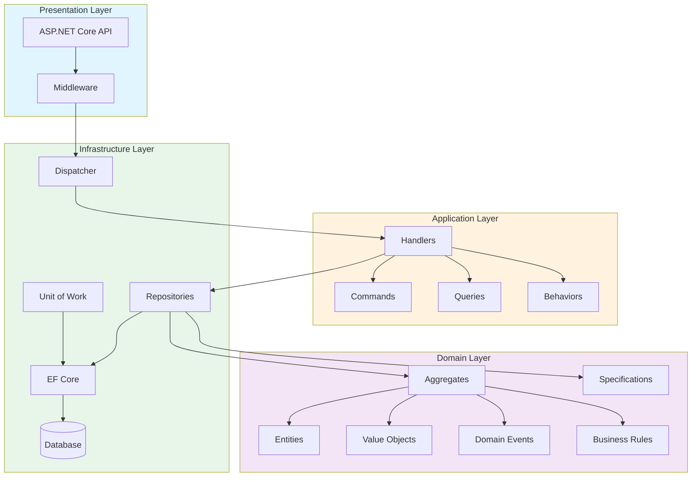
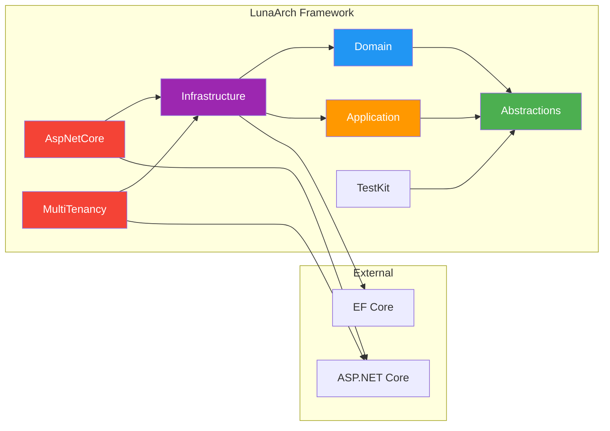
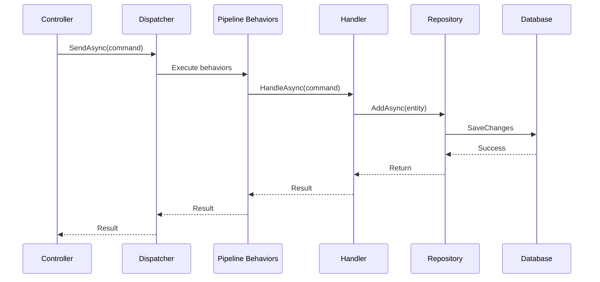

# Architecture Overview

LunaArch implements Clean Architecture with Domain-Driven Design patterns, providing a structured approach to building maintainable enterprise applications.

## Architecture Diagram



## Dependency Flow



## Layer Responsibilities

### Abstractions Layer
The foundation layer containing interfaces and base types with **zero external dependencies**:
- Domain primitives (`Entity`, `AggregateRoot`, `ValueObject`)
- Event interfaces (`IDomainEvent`, `IDomainEventHandler`)
- Messaging contracts (`ICommand`, `IQuery`, `IDispatcher`)
- Persistence abstractions (`IRepository`, `IUnitOfWork`)

### Domain Layer
Contains domain-specific building blocks:
- `Specification<T>` for query encapsulation
- Business rule validation
- Guard clauses for input validation

### Application Layer
Orchestrates application workflows:
- Application-specific exceptions
- Pipeline behaviors for cross-cutting concerns
- Command/Query validation

### Infrastructure Layer
Implements technical concerns:
- `Dispatcher` for command/query routing
- `RepositoryBase` with EF Core
- `DbContextBase` with domain event dispatching
- Interceptors for auditing and soft delete

### AspNetCore Layer
Web API integration:
- Exception handling middleware
- Correlation ID middleware
- Standard API response format
- Service registration extensions

## Design Principles

### 1. Dependency Inversion
All dependencies point inward toward the domain:
```
Presentation → Application → Domain ← Infrastructure
```

### 2. Explicit Dependencies
No hidden dependencies or service location. All dependencies are explicitly injected:
```csharp
public class OrderHandler(
    IRepository<Order, Guid> repository,  // Explicit
    IDateTimeProvider dateTime)           // Explicit
{
}
```

### 3. AOT Compatibility
Designed for Ahead-of-Time compilation:
- Explicit handler registration (no assembly scanning)
- Minimal reflection usage
- Source generators friendly

### 4. Testability
Every component is designed for testing:
- Interface-based abstractions
- TestKit with fake implementations
- No static dependencies

## Request Flow



## Next Steps

- [Layer Responsibilities](layers.md) - Detailed layer documentation
- [Domain Primitives](domain-primitives.md) - Entities, Value Objects, Aggregates
- [CQRS and Messaging](cqrs.md) - Commands, Queries, Dispatcher
