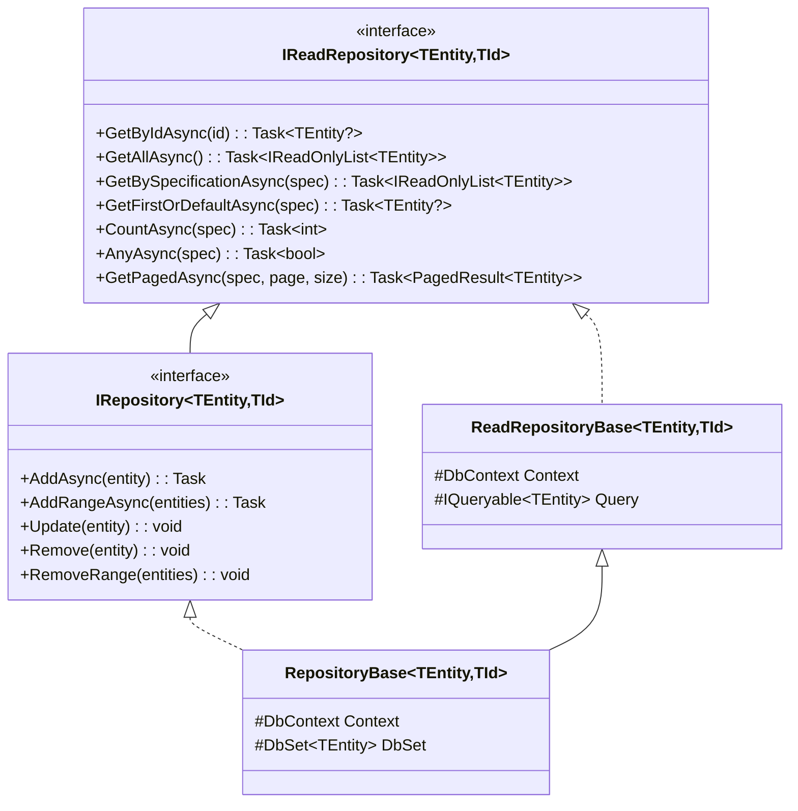
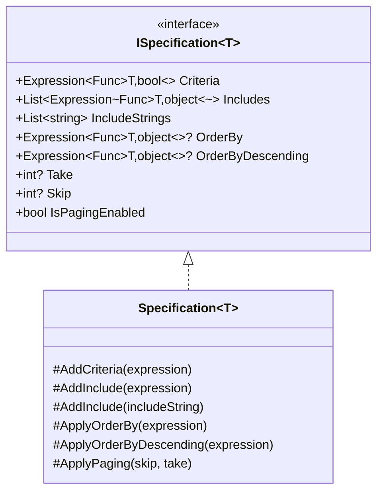
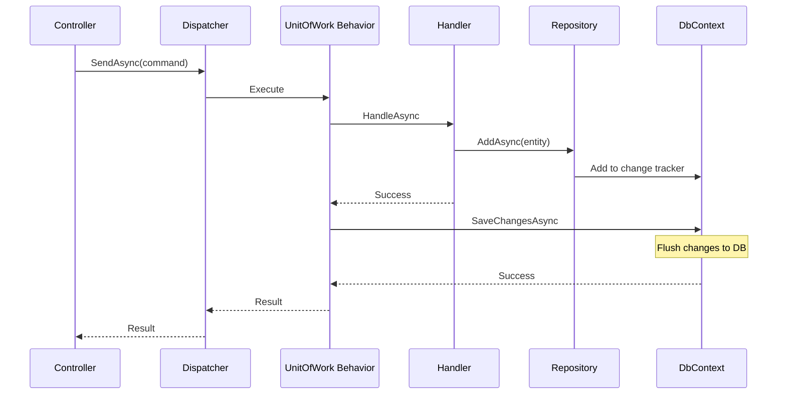

# Persistence

LunaArch provides a robust persistence layer built on the Repository pattern with Entity Framework Core.

## Repository Pattern



## IReadRepository

Read-only repository for query operations. Use this for queries to enforce read-only access.

```csharp
public interface IReadRepository<TEntity, TId>
    where TEntity : Entity<TId>
    where TId : notnull
{
    Task<TEntity?> GetByIdAsync(TId id, CancellationToken cancellationToken = default);
    
    Task<IReadOnlyList<TEntity>> GetAllAsync(CancellationToken cancellationToken = default);
    
    Task<IReadOnlyList<TEntity>> GetBySpecificationAsync(
        ISpecification<TEntity> specification,
        CancellationToken cancellationToken = default);
    
    Task<TEntity?> GetFirstOrDefaultAsync(
        ISpecification<TEntity> specification,
        CancellationToken cancellationToken = default);
    
    Task<int> CountAsync(
        ISpecification<TEntity>? specification = null,
        CancellationToken cancellationToken = default);
    
    Task<bool> AnyAsync(
        ISpecification<TEntity>? specification = null,
        CancellationToken cancellationToken = default);
    
    Task<PagedResult<TEntity>> GetPagedAsync(
        ISpecification<TEntity> specification,
        int pageNumber,
        int pageSize,
        CancellationToken cancellationToken = default);
}
```

## IRepository

Full repository with write operations. Only available for aggregate roots.

```csharp
public interface IRepository<TEntity, TId> : IReadRepository<TEntity, TId>
    where TEntity : AggregateRoot<TId>
    where TId : notnull
{
    Task AddAsync(TEntity entity, CancellationToken cancellationToken = default);
    
    Task AddRangeAsync(IEnumerable<TEntity> entities, CancellationToken cancellationToken = default);
    
    void Update(TEntity entity);
    
    void Remove(TEntity entity);
    
    void RemoveRange(IEnumerable<TEntity> entities);
}
```

## Specification Pattern

Specifications encapsulate query logic in reusable, composable objects.

### Specification Structure



### Creating Specifications

```csharp
// Simple specification
public sealed class OrderByIdSpecification : Specification<Order>
{
    public OrderByIdSpecification(Guid orderId)
    {
        AddCriteria(o => o.Id == orderId);
        AddInclude(o => o.Lines);
    }
}

// Specification with multiple criteria
public sealed class OrdersByCustomerSpecification : Specification<Order>
{
    public OrdersByCustomerSpecification(Guid customerId, OrderStatus? status = null)
    {
        AddCriteria(o => o.CustomerId == customerId);

        if (status.HasValue)
        {
            AddCriteria(o => o.Status == status.Value);
        }

        ApplyOrderByDescending(o => o.CreatedAt);
    }
}

// Specification with eager loading
public sealed class OrderWithDetailsSpecification : Specification<Order>
{
    public OrderWithDetailsSpecification(Guid orderId)
    {
        AddCriteria(o => o.Id == orderId);
        
        // Include related entities
        AddInclude(o => o.Lines);
        AddInclude(o => o.Customer);
        
        // Include nested entities using string path
        AddInclude("Lines.Product");
    }
}
```

### Using Specifications

```csharp
public sealed class GetOrdersQueryHandler(
    IReadRepository<Order, Guid> repository)
    : IQueryHandler<GetOrdersQuery, PagedResult<OrderDto>>
{
    public async Task<PagedResult<OrderDto>> HandleAsync(
        GetOrdersQuery query,
        CancellationToken cancellationToken)
    {
        var spec = new OrdersByCustomerSpecification(
            query.CustomerId,
            query.Status);

        var pagedOrders = await repository.GetPagedAsync(
            spec,
            query.PageNumber,
            query.PageSize,
            cancellationToken);

        return new PagedResult<OrderDto>(
            pagedOrders.Items.Select(MapToDto).ToList(),
            pagedOrders.TotalCount,
            pagedOrders.PageNumber,
            pagedOrders.PageSize);
    }

    private static OrderDto MapToDto(Order order) => new(
        order.Id,
        order.CustomerName,
        order.Total.Amount,
        order.Status.Name);
}
```

### Combining Specifications

```csharp
// Using extension methods
var activeOrders = new ActiveOrdersSpecification();
var premiumCustomer = new PremiumCustomerOrdersSpecification();

// Combine with AND
var combined = activeOrders.And(premiumCustomer);

// Combine with OR
var either = activeOrders.Or(premiumCustomer);

// Negate
var notActive = activeOrders.Not();
```

## Unit of Work

The Unit of Work pattern coordinates writing changes to the database.

```csharp
public interface IUnitOfWork
{
    Task<int> SaveChangesAsync(CancellationToken cancellationToken = default);
}
```

### Automatic Unit of Work

The `UnitOfWorkBehavior` automatically saves changes after command execution:

```csharp
public sealed class UnitOfWorkBehavior<TRequest, TResponse>(
    IUnitOfWork unitOfWork)
    : IPipelineBehavior<TRequest, TResponse>
    where TRequest : ICommand<TResponse>
{
    public async Task<TResponse> HandleAsync(
        TRequest request,
        Func<Task<TResponse>> next,
        CancellationToken cancellationToken = default)
    {
        var response = await next();
        
        // Automatically save after command completes
        await unitOfWork.SaveChangesAsync(cancellationToken);
        
        return response;
    }
}
```

### Transaction Flow



## DbContext Configuration

### Base DbContext

```csharp
public abstract class DbContextBase(DbContextOptions options) : DbContext(options)
{
    private readonly List<IDomainEvent> _domainEvents = [];

    public override async Task<int> SaveChangesAsync(
        CancellationToken cancellationToken = default)
    {
        // Collect domain events before saving
        var aggregates = ChangeTracker
            .Entries<AggregateRoot<object>>()
            .Where(e => e.Entity.DomainEvents.Any())
            .Select(e => e.Entity)
            .ToList();

        foreach (var aggregate in aggregates)
        {
            _domainEvents.AddRange(aggregate.DomainEvents);
            aggregate.ClearDomainEvents();
        }

        var result = await base.SaveChangesAsync(cancellationToken);

        // Domain events can be dispatched here or via outbox pattern

        return result;
    }
}
```

### Entity Configuration

```csharp
public class OrderConfiguration : IEntityTypeConfiguration<Order>
{
    public void Configure(EntityTypeBuilder<Order> builder)
    {
        builder.ToTable("Orders");
        
        builder.HasKey(o => o.Id);
        
        // Value object mapping
        builder.OwnsOne(o => o.Total, money =>
        {
            money.Property(m => m.Amount)
                .HasColumnName("TotalAmount")
                .HasPrecision(18, 2);
            money.Property(m => m.Currency)
                .HasColumnName("TotalCurrency")
                .HasMaxLength(3);
        });

        // Enumeration mapping
        builder.Property(o => o.Status)
            .HasConversion(
                s => s.Id,
                id => OrderStatus.FromId(id));

        // Collection mapping
        builder.HasMany(o => o.Lines)
            .WithOne()
            .HasForeignKey("OrderId")
            .OnDelete(DeleteBehavior.Cascade);

        // Audit fields
        builder.Property(o => o.CreatedAt);
        builder.Property(o => o.CreatedBy).HasMaxLength(256);
        builder.Property(o => o.ModifiedAt);
        builder.Property(o => o.ModifiedBy).HasMaxLength(256);
    }
}
```

## Interceptors

### Auditable Entity Interceptor

Automatically sets audit fields on entities implementing `IAuditableEntity`:

```csharp
public sealed class AuditableEntityInterceptor(
    IDateTimeProvider dateTimeProvider,
    ICurrentUserService currentUserService)
    : SaveChangesInterceptor
{
    public override ValueTask<InterceptionResult<int>> SavingChangesAsync(
        DbContextEventData eventData,
        InterceptionResult<int> result,
        CancellationToken cancellationToken = default)
    {
        var context = eventData.Context;
        if (context is null) return base.SavingChangesAsync(eventData, result, cancellationToken);

        var now = dateTimeProvider.UtcNow;
        var userId = currentUserService.UserId;

        foreach (var entry in context.ChangeTracker.Entries<IAuditableEntity>())
        {
            switch (entry.State)
            {
                case EntityState.Added:
                    entry.Entity.CreatedAt = now;
                    entry.Entity.CreatedBy = userId;
                    break;

                case EntityState.Modified:
                    entry.Entity.ModifiedAt = now;
                    entry.Entity.ModifiedBy = userId;
                    break;
            }
        }

        return base.SavingChangesAsync(eventData, result, cancellationToken);
    }
}
```

### Soft Delete Interceptor

Converts delete operations to soft deletes for entities implementing `ISoftDeletable`:

```csharp
public sealed class SoftDeleteInterceptor(
    IDateTimeProvider dateTimeProvider,
    ICurrentUserService currentUserService)
    : SaveChangesInterceptor
{
    public override ValueTask<InterceptionResult<int>> SavingChangesAsync(
        DbContextEventData eventData,
        InterceptionResult<int> result,
        CancellationToken cancellationToken = default)
    {
        var context = eventData.Context;
        if (context is null) return base.SavingChangesAsync(eventData, result, cancellationToken);

        foreach (var entry in context.ChangeTracker.Entries<ISoftDeletable>())
        {
            if (entry.State == EntityState.Deleted)
            {
                entry.State = EntityState.Modified;
                entry.Entity.IsDeleted = true;
                entry.Entity.DeletedAt = dateTimeProvider.UtcNow;
                entry.Entity.DeletedBy = currentUserService.UserId;
            }
        }

        return base.SavingChangesAsync(eventData, result, cancellationToken);
    }
}
```

## Registration

```csharp
// In Program.cs
services.AddLunaArch<AppDbContext>(options =>
{
    options.UseSqlServer(connectionString);
});

// This registers:
// - DbContext with interceptors
// - IUnitOfWork
// - Generic IRepository<,> and IReadRepository<,>
// - Specification evaluator
```

## Best Practices

### 1. Use Read Repository for Queries
```csharp
// ✅ Query handler uses IReadRepository
public class GetOrderQueryHandler(IReadRepository<Order, Guid> repository) { }

// ❌ Query handler shouldn't have write access
public class GetOrderQueryHandler(IRepository<Order, Guid> repository) { }
```

### 2. One Repository Per Aggregate Root
```csharp
// ✅ Repository for aggregate root
public interface IOrderRepository : IRepository<Order, Guid> { }

// ❌ Don't create repositories for non-root entities
public interface IOrderLineRepository : IRepository<OrderLine, Guid> { } // Wrong!
```

### 3. Use Specifications for Complex Queries
```csharp
// ✅ Reusable specification
var spec = new OrdersByCustomerSpecification(customerId);
var orders = await repository.GetBySpecificationAsync(spec);

// ❌ Inline query logic
var orders = await context.Orders
    .Where(o => o.CustomerId == customerId)
    .OrderByDescending(o => o.CreatedAt)
    .ToListAsync(); // Duplicated everywhere!
```

### 4. Include Related Data Explicitly
```csharp
// ✅ Explicit includes in specification
public class OrderWithLinesSpecification : Specification<Order>
{
    public OrderWithLinesSpecification(Guid orderId)
    {
        AddCriteria(o => o.Id == orderId);
        AddInclude(o => o.Lines); // Explicit eager loading
    }
}
```

## Next Steps

- [Multi-tenancy](multi-tenancy.md) - Tenant-aware persistence
- [Testing](testing.md) - Testing with fake repositories
