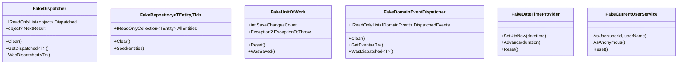

# Testing

LunaArch provides a TestKit package with fake implementations to simplify unit testing. We recommend using [Shouldly](https://github.com/shouldly/shouldly) for assertions.

## Testing Dependencies

```xml
<PackageReference Include="xunit" />
<PackageReference Include="Shouldly" />
<PackageReference Include="NSubstitute" />
```

## TestKit Package

```bash
dotnet add package LunaArch.TestKit
```

## Available Fakes



## Testing Command Handlers

### Basic Test Structure

```csharp
using Shouldly;

public class CreateOrderCommandHandlerTests
{
    private readonly FakeRepository<Order, OrderId> _orderRepository;
    private readonly FakeRepository<Customer, CustomerId> _customerRepository;
    private readonly FakeUnitOfWork _unitOfWork;
    private readonly CreateOrderCommandHandler _handler;

    public CreateOrderCommandHandlerTests()
    {
        _orderRepository = new FakeRepository<Order, OrderId>();
        _customerRepository = new FakeRepository<Customer, CustomerId>();
        _unitOfWork = new FakeUnitOfWork();
        
        _handler = new CreateOrderCommandHandler(
            _orderRepository,
            _customerRepository);
    }

    [Fact]
    public async Task Handle_ValidCommand_CreatesOrder()
    {
        // Arrange
        var customer = Customer.Create("John Doe");
        _customerRepository.Seed(customer);

        var command = new CreateOrderCommand(
            customer.Id,
            [new OrderItemDto(ProductId.New(), 2)]);

        // Act
        var orderId = await _handler.HandleAsync(command);

        // Assert
        var order = await _orderRepository.GetByIdAsync(orderId);
        
        order.ShouldNotBeNull();
        order.CustomerId.ShouldBe(customer.Id);
        order.Lines.Count.ShouldBe(1);
    }

    [Fact]
    public async Task Handle_CustomerNotFound_ThrowsNotFoundException()
    {
        // Arrange
        var command = new CreateOrderCommand(
            CustomerId.New(), // Non-existent customer
            [new OrderItemDto(ProductId.New(), 1)]);

        // Act & Assert
        var exception = await Should.ThrowAsync<NotFoundException>(
            () => _handler.HandleAsync(command));
        
        exception.Message.ShouldContain("Customer");
    }
}
```

### Using Test Builders

```csharp
public class CreateOrderCommandHandlerTests
{
    [Fact]
    public async Task Handle_ValidCommand_CreatesOrder()
    {
        // Arrange
        var repository = new FakeRepository<Order, OrderId>();
        var customerRepo = new FakeRepository<Customer, CustomerId>();
        var customer = Customer.Create("John Doe");
        customerRepo.Seed(customer);

        var result = await new CommandHandlerTestBuilder<
                CreateOrderCommand, OrderId, CreateOrderCommandHandler>()
            .WithHandler(new CreateOrderCommandHandler(repository, customerRepo))
            .WithCommand(new CreateOrderCommand(customer.Id, []))
            .ExecuteAsync();

        // Assert
        result.Value.ShouldNotBe(Guid.Empty);
    }

    [Fact]
    public async Task Handle_InvalidCustomer_ThrowsException()
    {
        var exception = await new CommandHandlerTestBuilder<
                CreateOrderCommand, OrderId, CreateOrderCommandHandler>()
            .WithHandler(new CreateOrderCommandHandler(
                new FakeRepository<Order, OrderId>(),
                new FakeRepository<Customer, CustomerId>()))
            .WithCommand(new CreateOrderCommand(CustomerId.New(), []))
            .ExecuteExpectingExceptionAsync<NotFoundException>();

        exception.Message.ShouldContain("Customer");
    }
}
```

## Testing Query Handlers

```csharp
public class GetOrderByIdQueryHandlerTests
{
    [Fact]
    public async Task Handle_ExistingOrder_ReturnsDto()
    {
        // Arrange
        var repository = new FakeRepository<Order, OrderId>();
        var order = Order.Create(CustomerId.New());
        repository.Seed(order);

        var handler = new GetOrderByIdQueryHandler(repository);
        var query = new GetOrderByIdQuery(order.Id);

        // Act
        var result = await handler.HandleAsync(query);

        // Assert
        result.ShouldNotBeNull();
        result.Id.ShouldBe(order.Id);
    }

    [Fact]
    public async Task Handle_NonExistingOrder_ReturnsNull()
    {
        // Arrange
        var repository = new FakeRepository<Order, OrderId>();
        var handler = new GetOrderByIdQueryHandler(repository);
        var query = new GetOrderByIdQuery(OrderId.New());

        // Act
        var result = await handler.HandleAsync(query);

        // Assert
        result.ShouldBeNull();
    }
}
```

## Testing Domain Entities

### Testing Aggregate Behavior

```csharp
public class OrderTests
{
    private readonly FakeDateTimeProvider _dateTimeProvider;

    public OrderTests()
    {
        _dateTimeProvider = new FakeDateTimeProvider();
        _dateTimeProvider.SetUtcNow(new DateTimeOffset(2024, 1, 1, 0, 0, 0, TimeSpan.Zero));
    }

    [Fact]
    public void Create_ValidInput_CreatesOrder()
    {
        // Act
        var order = Order.Create(CustomerId.New());

        // Assert
        order.ShouldNotBeNull();
        order.Id.Value.ShouldNotBe(Guid.Empty);
        order.Status.ShouldBe(OrderStatus.Draft);
    }

    [Fact]
    public void AddLine_ValidProduct_AddsLineAndRaisesEvent()
    {
        // Arrange
        var order = Order.Create(CustomerId.New());
        var productId = ProductId.New();

        // Act
        order.AddLine(productId, 2, Money.From(10));

        // Assert
        order.Lines.Count.ShouldBe(1);
        order.Lines[0].ProductId.ShouldBe(productId);
        order.Lines[0].Quantity.ShouldBe(2);
        
        order.DomainEvents.ShouldHaveSingleItem()
            .ShouldBeOfType<OrderLineAddedEvent>();
    }

    [Fact]
    public void Complete_EmptyOrder_ThrowsDomainException()
    {
        // Arrange
        var order = Order.Create(CustomerId.New());

        // Act & Assert
        var exception = Should.Throw<DomainException>(() => order.Complete());
        exception.Message.ShouldContain("at least one line");
    }

    [Fact]
    public void Complete_ValidOrder_CompletesAndRaisesEvent()
    {
        // Arrange
        var order = Order.Create(CustomerId.New());
        order.AddLine(ProductId.New(), 1, Money.From(100));
        order.ClearDomainEvents(); // Clear previous events

        // Act
        order.Complete();

        // Assert
        order.Status.ShouldBe(OrderStatus.Completed);
        order.DomainEvents.ShouldHaveSingleItem()
            .ShouldBeOfType<OrderCompletedEvent>();
    }
}
```

### Testing Value Objects

```csharp
public class MoneyTests
{
    [Fact]
    public void Create_ValidInput_CreatesMoney()
    {
        var money = Money.From(100);

        money.Value.ShouldBe(100);
    }

    [Fact]
    public void Create_NegativeAmount_ThrowsException()
    {
        Should.Throw<ValueObjectValidationException>(() => Money.From(-10));
    }

    [Fact]
    public void Add_SameType_ReturnsSum()
    {
        var money1 = Money.From(100);
        var money2 = Money.From(50);

        var result = money1 + money2;

        result.Value.ShouldBe(150);
    }

    [Fact]
    public void Equals_SameValue_ReturnsTrue()
    {
        var money1 = Money.From(100);
        var money2 = Money.From(100);

        money1.ShouldBe(money2);
        (money1 == money2).ShouldBeTrue();
    }
}
```

## Testing Domain Events

```csharp
public class OrderDomainEventTests
{
    [Fact]
    public void Create_RaisesOrderCreatedEvent()
    {
        // Act
        var order = Order.Create(CustomerId.New());

        // Assert
        var domainEvent = order.DomainEvents.ShouldHaveSingleItem();
        var createdEvent = domainEvent.ShouldBeOfType<OrderCreatedEvent>();
        createdEvent.OrderId.ShouldBe(order.Id);
    }

    [Fact]
    public async Task Handler_ProcessesEvent()
    {
        // Arrange
        var emailService = Substitute.For<IEmailService>();
        var handler = new OrderCreatedEventHandler(emailService);
        var domainEvent = new OrderCreatedEvent(OrderId.New(), CustomerId.New());

        // Act
        await handler.HandleAsync(domainEvent);

        // Assert
        await emailService.Received(1)
            .SendOrderConfirmationAsync(domainEvent.OrderId, Arg.Any<CancellationToken>());
    }
}
```

## Testing with Specifications

```csharp
public class OrderSpecificationTests
{
    [Fact]
    public async Task OrdersByCustomerSpecification_FiltersCorrectly()
    {
        // Arrange
        var repository = new FakeRepository<Order, OrderId>();
        var customerId = CustomerId.New();
        var otherCustomerId = CustomerId.New();

        repository.Seed(
            CreateOrder(customerId),
            CreateOrder(customerId),
            CreateOrder(otherCustomerId));

        var spec = new OrdersByCustomerSpecification(customerId);

        // Act
        var orders = await repository.GetBySpecificationAsync(spec);

        // Assert
        orders.Count.ShouldBe(2);
        orders.ShouldAllBe(o => o.CustomerId == customerId);
    }

    [Fact]
    public async Task OrdersByStatusSpecification_FiltersCorrectly()
    {
        // Arrange
        var repository = new FakeRepository<Order, OrderId>();
        
        var completedOrder = CreateOrder(CustomerId.New());
        completedOrder.AddLine(ProductId.New(), 1, Money.From(10));
        completedOrder.Complete();
        
        var draftOrder = CreateOrder(CustomerId.New());
        
        repository.Seed(completedOrder, draftOrder);

        var spec = new OrdersByStatusSpecification(OrderStatus.Completed);

        // Act
        var orders = await repository.GetBySpecificationAsync(spec);

        // Assert
        var order = orders.ShouldHaveSingleItem();
        order.Status.ShouldBe(OrderStatus.Completed);
    }

    private static Order CreateOrder(CustomerId customerId)
        => Order.Create(customerId);
}
```

## Testing Time-Dependent Code

```csharp
public class AuditableEntityTests
{
    [Fact]
    public void CreatedAt_IsSetCorrectly()
    {
        // Arrange
        var dateTimeProvider = new FakeDateTimeProvider();
        var expectedTime = new DateTimeOffset(2024, 6, 15, 10, 30, 0, TimeSpan.Zero);
        dateTimeProvider.SetUtcNow(expectedTime);

        var userService = new FakeCurrentUserService().AsUser("user-123", "John");
        
        // Simulate what the interceptor does
        var order = Order.Create(CustomerId.New());
        ((IAuditableEntity)order).CreatedAt = dateTimeProvider.UtcNow;
        ((IAuditableEntity)order).CreatedBy = userService.UserId;

        // Assert
        ((IAuditableEntity)order).CreatedAt.ShouldBe(expectedTime);
        ((IAuditableEntity)order).CreatedBy.ShouldBe("user-123");
    }

    [Fact]
    public void Advance_UpdatesTime()
    {
        var dateTimeProvider = new FakeDateTimeProvider();
        dateTimeProvider.SetUtcNow(new DateTimeOffset(2024, 1, 1, 0, 0, 0, TimeSpan.Zero));

        dateTimeProvider.Advance(TimeSpan.FromHours(2));

        dateTimeProvider.UtcNow.ShouldBe(
            new DateTimeOffset(2024, 1, 1, 2, 0, 0, TimeSpan.Zero));
    }
}
```

## Integration Testing

### Testing with Real DbContext

```csharp
public class OrderRepositoryIntegrationTests : IDisposable
{
    private readonly AppDbContext _context;
    private readonly RepositoryBase<Order, OrderId> _repository;

    public OrderRepositoryIntegrationTests()
    {
        var options = new DbContextOptionsBuilder<AppDbContext>()
            .UseInMemoryDatabase(Guid.NewGuid().ToString())
            .Options;

        _context = new AppDbContext(options);
        _repository = new RepositoryBase<Order, OrderId>(_context);
    }

    [Fact]
    public async Task AddAndRetrieve_WorksCorrectly()
    {
        // Arrange
        var order = Order.Create(CustomerId.New());

        // Act
        await _repository.AddAsync(order);
        await _context.SaveChangesAsync();

        var retrieved = await _repository.GetByIdAsync(order.Id);

        // Assert
        retrieved.ShouldNotBeNull();
        retrieved.Id.ShouldBe(order.Id);
    }

    public void Dispose()
    {
        _context.Dispose();
    }
}
```

## Best Practices

### 1. Test Behavior, Not Implementation
```csharp
// ✅ Test behavior
[Fact]
public void Complete_ValidOrder_ChangesStatusToCompleted()
{
    var order = CreateValidOrder();
    order.Complete();
    order.Status.ShouldBe(OrderStatus.Completed);
}

// ❌ Don't test implementation details
[Fact]
public void Complete_SetsStatusField()
{
    var order = CreateValidOrder();
    order.Complete();
    // Testing private field directly
}
```

### 2. Use Descriptive Test Names
```csharp
// ✅ Descriptive
[Fact]
public async Task Handle_CustomerNotFound_ThrowsNotFoundException()

// ❌ Not descriptive
[Fact]
public async Task Test1()
```

### 3. Arrange-Act-Assert Pattern
```csharp
[Fact]
public async Task Handle_ValidCommand_CreatesOrder()
{
    // Arrange
    var repository = new FakeRepository<Order, OrderId>();
    var handler = new CreateOrderCommandHandler(repository);
    var command = new CreateOrderCommand(CustomerId.New(), []);

    // Act
    var result = await handler.HandleAsync(command);

    // Assert
    result.Value.ShouldNotBe(Guid.Empty);
}
```

### 4. One Assertion Concept Per Test
```csharp
// ✅ Single concept
[Fact]
public void Create_ValidInput_CreatesOrder()
{
    var order = Order.Create(customerId);
    order.ShouldNotBeNull();
}

[Fact]
public void Create_ValidInput_SetsStatusToDraft()
{
    var order = Order.Create(customerId);
    order.Status.ShouldBe(OrderStatus.Draft);
}

// ❌ Multiple unrelated assertions
[Fact]
public void Create_ValidInput_IsCorrect()
{
    var order = Order.Create(customerId);
    order.ShouldNotBeNull();
    order.Status.ShouldBe(OrderStatus.Draft);
    order.CustomerId.ShouldBe(customerId);
    order.Lines.ShouldBeEmpty();
    // Too many assertions!
}
```
